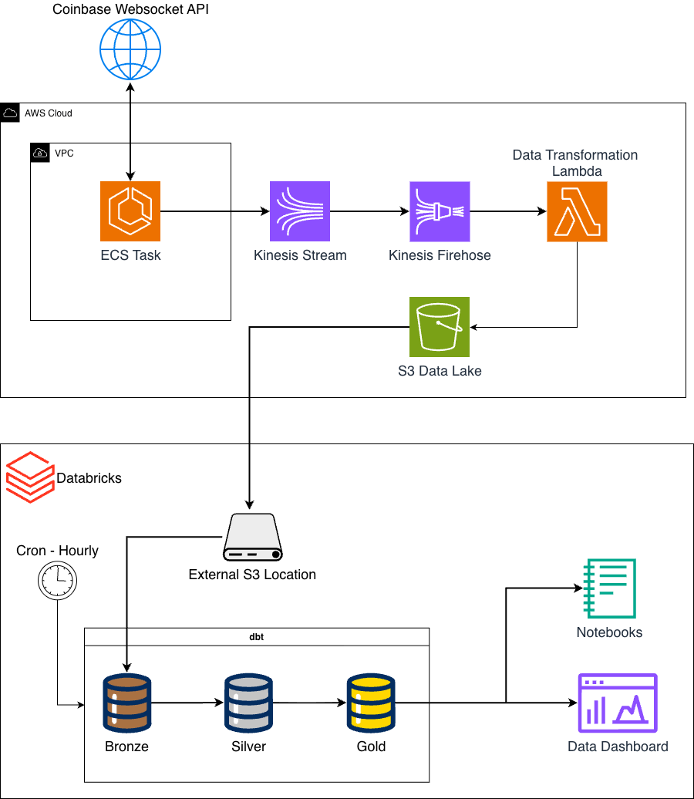
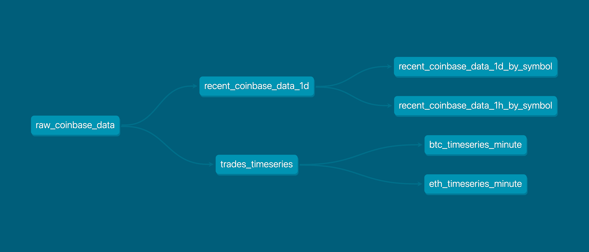

# Real-Time Cryptocurrency Trade Ingestion Pipeline

This is a scalable data streaming pipeline that 
ingests over 1.3 million cryptocurrency trades a day from 
Coinbase Websocket API, which are made available in a Databricks
catalog.

## Tools/Services Used




### Data Ingestion

#### Websocket API Consumer Script

A Python script (`ecs/websocket_script_coinbase_v2.py`)
subscribes to the Coinbase Websocket API. 
The script is put into a Docker image and deployed as an ECS task. 
The ECS cluster uses the EC2 launch type, primarily for cost savings.

Received messages are sent to a Kinesis stream, then transformed 
using Firehose and saved to an existing S3 bucket.

#### Data Extraction to Databricks

An external location in Databricks was connected, in order to access raw data
from S3. Databricks automates the process of creating the necessary 
infrastructure such as IAM roles in the AWS account to enable access.

#### Raw Data Transformations

A dbt project was created under `coinbase_data_flow` that handles data 
transformations from the raw S3 data.

Data Models (Medallion Architecture)
* Bronze
  * raw_coinbase_data - returns raw trade data from the past 90 days
* Silver
  * trades_timeseries - deduped list of trades from the past 90 days
  * recent_coinbase_data_1d - simplified trade data from past 24 hours (used for troubleshooting)
  * recent_coinbase_data_1d_by_symbol - trade counts per symbol over the past 24 hours (used for troubleshooting)
  * recent_coinbase_data_1h_by_symbol - trade counts per symbol over the past hour (used for troubleshooting)
* Gold
  * btc_timeseries_minute - aggregate trade data by the minute for Bitcoin over the past 7 days
  * eth_timeseries_minute - aggregate trade data by the minute for Ethereum over the past 7 days




### VPC Infrastructure

The ECS cluster is deployed to a VPC private subnet. As the ECS task needs
to send requests to an external API, a NAT gateway is needed in a public subnet.  

In addition, a Kinesis Endpoint were created to direct traffic to AWS Kinesis 
along the AWS backbone, a small optimization.


## Deployment

### Prerequisites

The following must already exist in the AWS account and region of deployment:
* A VPC with at least one public subnet and one private subnet with route tables
  * A NAT Gateway in the public subnet
* An S3 bucket
* CDK must be bootstrapped (run `cdk bootstrap`)
  * `cdk bootstrap aws://ACCOUNT-NUMBER/REGION` (replace values)
* An ECR registry and repo for the websocket script
  * AWS CLI command: `aws ecr create-repository --repository-name coinbase-websocket --region us-east-1`
* Databricks resources for S3 External Location access must be deployed (automatic process from Databricks)

Additionally, AWS CLI and cdk must be installed locally, with valid AWS credentials for deploying 
the appropriate resources, including IAM policies and roles.

### Endpoints Deployment

To deploy the required endpoints to the VPC, `cd` into the `cdk` folder. 
Set the correct environment variables for VPC ID and *private* subnet ID.
This CDK also creates a security group that we will need to attach to the EC2 instance(s) that
is managed by the ECS cluster.

```commandline
VPC_ID="<replace>"
SUBNET_ID="<replace>"
cdk deploy CryptoTradeEndpoints --context vpc_id=$VPC_ID --context subnet_id=$SUBNET_ID
```

Save the ID for the instance security group.

### Kinesis and Firehose Resource Deployment

This stack contains the Kinesis Data Stream, Firehose, and the Lambda function used for data transformation.
To deploy these resources, `cd` into the `cdk` folder, if you have not already done so. 
Set the correct environment variables for the S3 Bucket name.

```commandline
BUCKET_NAME="<replace>"
cdk deploy CryptoTradeFirehose --context bucket_name=$BUCKET_NAME
```

### ECS Deployment

To deploy these resources, `cd` into the `ecs` folder, if you have not already done so. 

#### Building the Image

To build the Docker image, run one of the two commands from the repository root:
This command builds for a single architecture, the default for your local machine
```commandline
docker build -f ecs/Dockerfile -t coinbase-websocket .
```
or (if buildx is installed, and multi-arch image build is enabled):
```commandline
docker buildx build --platform linux/arm64,linux/amd64 -f ecs/Dockerfile -t coinbase-websocket . --load
```

then run the following to push the image to the ECR (fix placeholders):
```commandline
AWS_REGION="<region>"
ECR_NAME="<aws-account-id>.dkr.ecr.${AWS_REGION}.amazonaws.com"
aws ecr get-login-password --region $AWS_REGION | docker login --username AWS --password-stdin "$ECR_NAME"

ECR_IMAGE_URI="$ECR_NAME/coinbase-websocket:latest"
docker tag coinbase-websocket $ECR_IMAGE_URI
docker push $ECR_IMAGE_URI
```

#### Deploying the ECS Cluster and Task

The ECS Cluster and Task are specified in the CDK `cdk/ecs_stack.py`.
This CDK contains everything related to the ECS task and infrastructure, including
the instance's security group, and all required IAM policies and roles.

To deploy the CDK, run these commands (Set the correct environment variables for VPC ID and *private* subnet ID):

```commandline
VPC_ID="<replace>"
SUBNET_ID="<replace>"
ECR_IMAGE_URI="<get-from-above>"
PRODUCT_ID="BTC-USD,ETH-USD" # example values, can be changed

cdk deploy CryptoWebsocketApp \
  --context subnet_id=$SUBNET_ID \
  --context vpc_id=$VPC_ID \
  --context ecr_image_uri=$ECR_IMAGE_URI \
  --context product_id=$PRODUCT_ID
```

